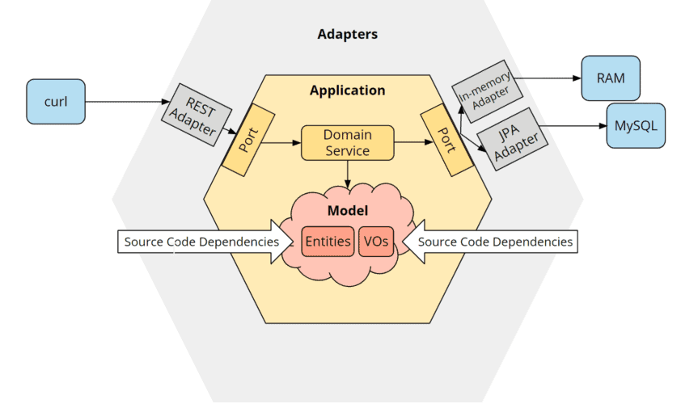
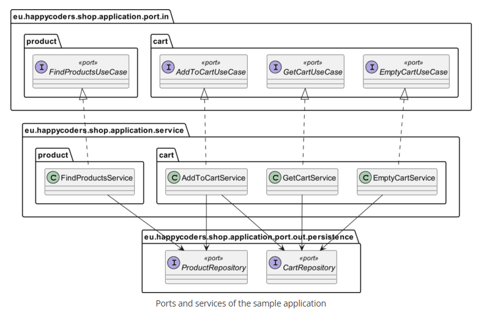
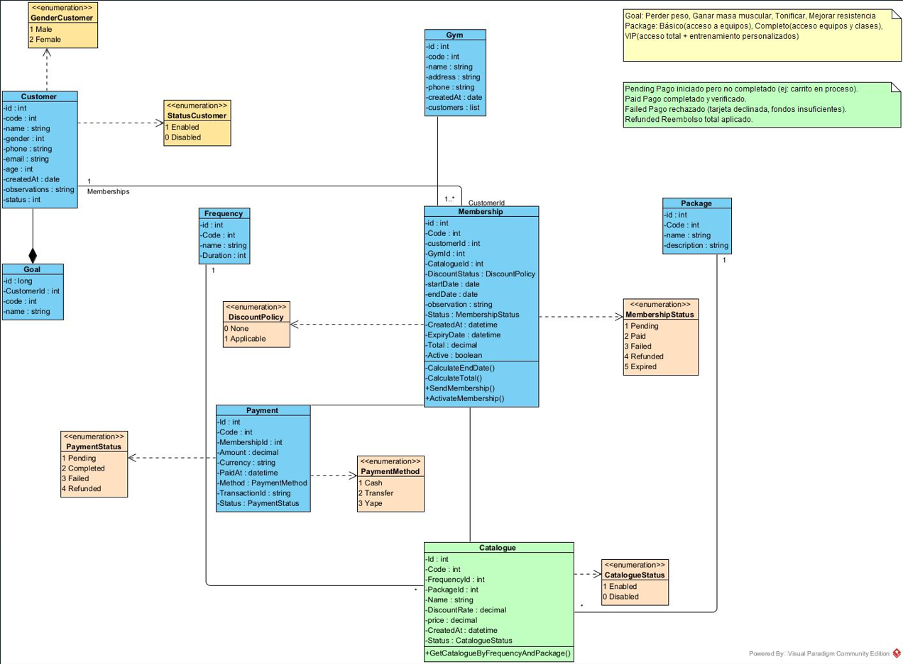

# 🏋️‍♂️ Gym Connect API

> **API for comprehensive gym membership management** — from client creation to payment tracking, including packages, frequencies, and price catalogs.

---

## 📌 Description

This RESTful API is designed to manage all key operations of a gym, enabling complete management of the member lifecycle.

### Key Features

-   **Client Management**: Creation, updating, and querying of client information.
-   **Membership Packages**: Definition of different access levels (Basic, Complete, VIP) with their characteristics.
-   **Access Frequencies**: Assignment of weekly access days to packages.
-   **Price Catalog**: Defines the cost for each `Frequency` + `Package` combination, applying discounts and setting the final price.
-   **Memberships**: Links a client to a specific package, assigning a frequency and calculating the total.
-   **Payments**: Registration and tracking of transactions, with states like Pending, Completed, Failed, or Refunded.
-   **Goals and Objectives**: Allows associating personal goals with the client (Lose weight, Gain muscle mass, etc.).

---

## 🧩 Architecture

The API follows a **Hexagonal (Ports & Adapters)** architectural pattern, which allows keeping the business core decoupled from external technologies (like databases or web frameworks).





---

## 🗺️ Solution Design (Domain Model)

The domain model is based on the main entities: Client, Package, Frequency, Catalog, Membership, and Payment. The `Catalogue` entity is crucial, acting as a "decision point" that combines a `Frequency` and a `Package` to calculate the final price and apply discounts.



---

## 🚀 Getting Started

### Requirements

-   Java 25 (or compatible version)
-   Maven 3.9+
-   MySQL 8.0+

### Setup

1. Clone the repository:

    ```bash
    git clone https://github.com/PedroAvila/gym-connect.git
    cd gym-connect
    ```

2. Configure the database in `application.properties`:

    ```properties
    spring.datasource.url=jdbc:mysql://localhost:3306/gym_connect
    spring.datasource.username=your_user
    spring.datasource.password=your_password
    ```

3. Run the application:

    ```bash
    mvn clean spring-boot:run
    ```

4. The API will be available at: `http://localhost:8080`

---

## 📡 Endpoints

To see the complete list of endpoints, you can use Swagger UI if integrated, or review the controllers in the source code.

---

## 🛡️ Error Handling

The API returns standardized error responses in JSON format, including a `traceId` to facilitate debugging.

Example error response:

```json
{
    "title": "Business Error",
    "detail": "Package not found: 4",
    "status": 404,
    "instance": "/packages/4",
    "timestamp": "2025-11-06T09:51:23.7594293",
    "traceId": "cf46d719-0d9f-4d7f-b653-fe78bff5f7fb"
}
```
